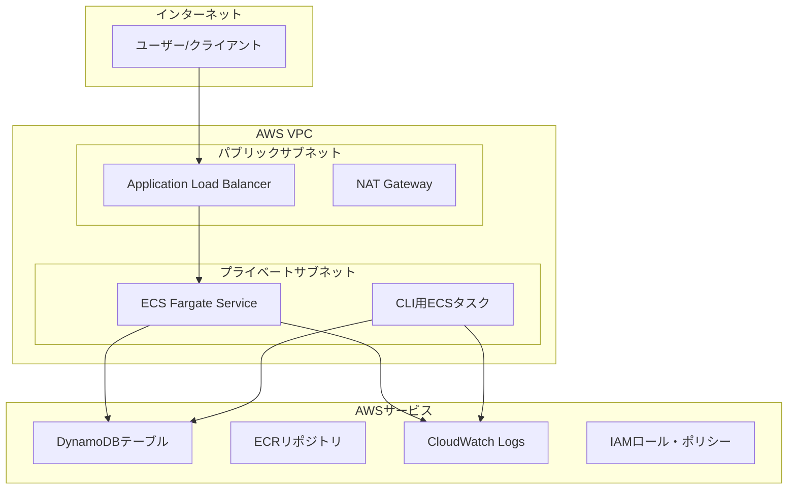

# 設計書

## 概要

この設計は、Terraformを使用してGo実績管理アプリケーションをデプロイするためのAWSインフラストラクチャを概説しています。インフラストラクチャは、モジュラーアプローチでAWSベストプラクティスに従い、複数の環境（開発、ステージング、本番）をサポートし、APIサーバーとCLIタスク実行機能の両方の安全でスケーラブルなデプロイメントを提供します。

この設計は、コンテナ化されたアプリケーションデプロイメント用のECS Fargate、データ永続化用のDynamoDB、ネットワーク分離用のVPC、セキュリティ用の包括的なIAMロールを活用しています。すべてのインフラストラクチャは、保守性と再利用性のためにTerraformモジュールを使用してコードとして定義されています。

## アーキテクチャ

### 高レベルアーキテクチャ



### ネットワークアーキテクチャ

- **VPC**: CIDRブロック10.0.0.0/16のカスタムVPC
- **パブリックサブネット**: ALBとNATゲートウェイ用の異なるAZにわたる2つのサブネット
- **プライベートサブネット**: ECSサービス用の異なるAZにわたる2つのサブネット
- **インターネットゲートウェイ**: パブリックサブネットのインターネットアクセス用
- **NATゲートウェイ**: プライベートサブネットのアウトバウンドインターネットアクセス用
- **セキュリティグループ**: 各コンポーネント用の制限的なルール

### コンテナアーキテクチャ

- **ECSクラスター**: サーバーレスコンテナ実行用のFargateクラスター
- **APIサービス**: 自動スケーリング機能付きHTTP API用の長時間実行サービス
- **CLIタスク**: コマンド実行用のオンデマンドタスク定義
- **ECRリポジトリ**: コンテナイメージ用のプライベートリポジトリ

## コンポーネントとインターフェース

### 1. Terraformモジュール構造

```
terraform/
├── main.tf                 # ルートモジュール設定
├── variables.tf            # 入力変数
├── outputs.tf             # 出力値
├── terraform.tf           # プロバイダーとバックエンド設定
├── environments/
│   ├── dev.tfvars         # 開発環境変数
│   ├── staging.tfvars     # ステージング環境変数
│   └── prod.tfvars        # 本番環境変数
└── modules/
    ├── vpc/               # VPCとネットワーキングリソース
    ├── ecs/               # ECSクラスター、サービス、タスク
    ├── dynamodb/          # DynamoDBテーブル
    ├── iam/               # IAMロールとポリシー
    ├── security/          # セキュリティグループ
    └── monitoring/        # CloudWatchとログ
```

### 2. VPCモジュール

**目的**: 分離されたネットワークインフラストラクチャの作成

**リソース**:
- DNS サポート付きVPC
- インターネットゲートウェイ
- 2つのAZにわたるパブリック/プライベートサブネット
- プライベートサブネットのインターネットアクセス用NATゲートウェイ
- ルートテーブルと関連付け

**出力**:
- VPC ID
- サブネットID（パブリック/プライベート）
- セキュリティグループID

### 3. ECSモジュール

**目的**: コンテナ化されたアプリケーションデプロイメントの管理

**リソース**:
- ECSクラスター（Fargate）
- タスク定義（APIサービスとCLIタスク）
- 自動スケーリング付きECSサービス
- Application Load Balancer
- ターゲットグループとヘルスチェック

**タスク定義**:
- **APIタスク**: ヘルスチェック付きで`./achievement-api`を実行
- **CLIタスク**: 異なるCLIコマンド用の複数のタスク定義
  - 実績管理タスク
  - ポイント管理タスク
  - 報酬管理タスク

### 4. DynamoDBモジュール

**目的**: 管理されたNoSQLデータベーステーブルの提供

**テーブル**:
- **実績テーブル**: 
  - パーティションキー: `user_id` (String)
  - ソートキー: `achievement_id` (String)
- **報酬テーブル**:
  - パーティションキー: `reward_id` (String)
- **現在ポイントテーブル**:
  - パーティションキー: `user_id` (String)
- **報酬履歴テーブル**:
  - パーティションキー: `user_id` (String)
  - ソートキー: `timestamp` (String)

**機能**:
- ポイントインタイムリカバリ有効
- サーバーサイド暗号化
- 環境固有のテーブル名

### 5. IAMモジュール

**目的**: 最小権限アクセス制御の実装

**ロール**:
- **ECSタスク実行ロール**: ECSがイメージをプルしログを書き込むため
- **ECSタスクロール**: アプリケーションがDynamoDBにアクセスするため
- **CLIタスクロール**: CLIコマンドがDynamoDBにアクセスするため

**ポリシー**:
- テーブルごとのDynamoDB読み書き権限
- CloudWatch Logs権限
- ECRイメージプル権限

### 6. セキュリティモジュール

**目的**: ネットワークセキュリティルールの定義

**セキュリティグループ**:
- **ALBセキュリティグループ**: インターネットからのHTTP/HTTPS
- **ECSセキュリティグループ**: ALBからのHTTPのみ
- **VPCエンドポイントセキュリティグループ**: プライベートサブネットからのHTTPS

### 7. モニタリングモジュール

**目的**: ログとモニタリングの提供

**リソース**:
- ECSタスク用CloudWatchロググループ
- ログ保持ポリシー
- CloudWatchメトリクスとアラーム

## データモデル

### 環境設定

```hcl
variable "environment" {
  description = "環境名 (dev, staging, prod)"
  type        = string
}

variable "app_name" {
  description = "アプリケーション名"
  type        = string
  default     = "achievement-management"
}

variable "aws_region" {
  description = "AWSリージョン"
  type        = string
  default     = "us-east-1"
}
```

### ECS設定

```hcl
variable "ecs_config" {
  description = "ECSサービス設定"
  type = object({
    cpu                = number
    memory             = number
    desired_count      = number
    max_capacity       = number
    min_capacity       = number
    container_port     = number
    health_check_path  = string
  })
}
```

### DynamoDB設定

```hcl
variable "dynamodb_tables" {
  description = "DynamoDBテーブル設定"
  type = map(object({
    hash_key           = string
    range_key          = optional(string)
    billing_mode       = string
    read_capacity      = optional(number)
    write_capacity     = optional(number)
    point_in_time_recovery = bool
  }))
}
```

## エラーハンドリング

### Terraform状態管理

- **リモート状態**: DynamoDBロック付きS3バックエンド
- **状態分離**: 環境ごとの個別状態ファイル
- **バックアップ戦略**: S3バージョニングとクロスリージョンレプリケーション

### リソース障害処理

- **ECSサービス**: ヘルスチェック付き自動復旧
- **DynamoDB**: 自動フェイルオーバー付きマルチAZデプロイメント
- **ALB**: ヘルスチェック付きマルチAZデプロイメント
- **NATゲートウェイ**: 手動フェイルオーバー付き単一AZ（コスト最適化）

### デプロイメントロールバック

- **ブルー/グリーンデプロイメント**: ECSサービス更新戦略
- **データベースマイグレーション**: 個別のマイグレーションタスク
- **設定ロールバック**: Terraform状態ロールバック機能

## テスト戦略

### インフラストラクチャテスト

1. **Terraform検証**:
   - 構文チェック用`terraform validate`
   - 変更プレビュー用`terraform plan`
   - ベストプラクティス検証用`tflint`

2. **セキュリティテスト**:
   - セキュリティ脆弱性スキャン用`tfsec`
   - IAMポリシー検証
   - セキュリティグループルール検証

3. **統合テスト**:
   - テスト環境へのデプロイ
   - アプリケーション接続テスト
   - データベースアクセス検証
   - ロードバランサーヘルスチェック検証

### 環境テスト

1. **開発環境**:
   - 最小限のリソース割り当て
   - ローカルDynamoDBエンドポイントサポート
   - デバッグログ有効

2. **ステージング環境**:
   - 本番環境に近い設定
   - 自動デプロイメントテスト
   - パフォーマンステスト

3. **本番環境**:
   - 高可用性設定
   - モニタリングとアラート
   - バックアップと災害復旧

### 自動テストパイプライン


### テストシナリオ

1. **アプリケーションデプロイメント**: ECSサービスが開始しヘルスチェックに合格することを確認
2. **データベース接続**: アプリケーションがDynamoDBに読み書きできることをテスト
3. **CLIタスク実行**: CLIタスクが正常に実行できることを確認
4. **ロードバランサー**: トラフィックルーティングとヘルスチェックをテスト
5. **自動スケーリング**: ECSサービスがメトリクスに基づいてスケールすることを確認
6. **セキュリティ**: ネットワーク分離とIAM権限をテスト
7. **モニタリング**: ログが収集されメトリクスが利用可能であることを確認